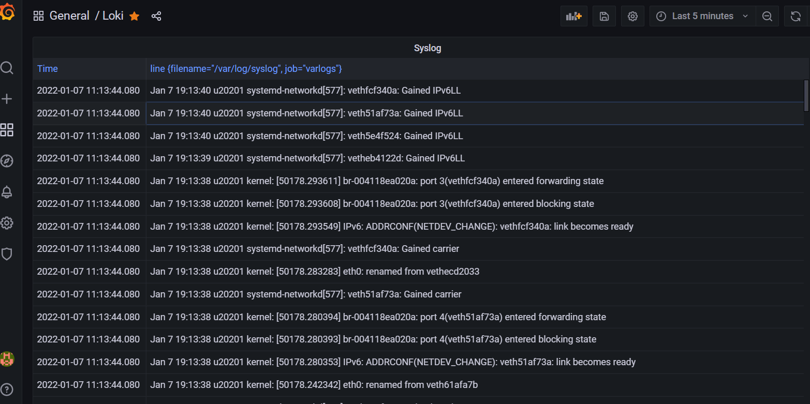

<!-- TABLE OF CONTENTS -->
<details>
  <summary>Table of Contents</summary>
  <ol>
    <li>
      <a href="#about-the-project">About The Project</a>
      <ul>
        <li><a href="#built-with">Built With</a></li>
      </ul>
    </li>
    <li>
      <a href="#getting-started">Getting Started</a>
      <ul>
        <li><a href="#prerequisites">Prerequisites</a></li>
        <li><a href="#installation">Installation</a></li>
      </ul>
    </li>
    <li><a href="#usage">Usage</a></li>
    <li><a href="#roadmap">Roadmap</a></li>
    <li><a href="#contributing">Contributing</a></li>
    <li><a href="#license">License</a></li>
    <li><a href="#contact">Contact</a></li>
    <li><a href="#acknowledgments">Acknowledgments</a></li>
  </ol>
</details>


<!-- ABOUT THE PROJECT -->

## About The Project

A monitoring solution for Docker hosts and containers with [loki](https://grafana.com/oss/loki/), [Grafana](http://grafana.org/), [promtail](https://grafana.com/docs/loki/latest/clients/promtail/).

Here's why:
* Your time should be focused on creating something amazing. A project that solves a problem and helps others
* You shouldn't be doing the same tasks over and over like creating a README from scratch
* You should implement DRY principles to the rest of your life :smile:

<p align="right">(<a href="#top">back to top</a>)</p>

### Built With

This section should list any major frameworks/libraries used to bootstrap your project. Leave any add-ons/plugins for the acknowledgements section. Here are a few examples.
* Docker
* Docker-compose

### Prerequisites

This is an example of how to list things you need to use the software and how to install them.
* Memory  >=2G  
  ```sh
  free -h
  ```
- Docker Version >=18.00
  ```sh
  docker version
  ```
- Docker Compose Version >=1.1
  ```sh
  docker-compose version
  ``` 

### Installation

1. Clone the repo
   ```sh
   git clone https://github.com/sonnyyu/log-file-analysis
   ```
2. Switch to directory
   ```sh
   cd log-file-analysis/loki-grafana-promtail/
   ```
3. Setup ownership as grafana
   ```sh
   sudo chown 472:472 -R grafana/grafana_data
   ```
4. Start up docker stack  as deamon
   ```sh
   docker-compose up -d
   ```
5. Stop docker stack
   ```sh
   docker-compose down -v
   ```
6. Delete all containers using the following command
   ```sh
   docker rm -f $(docker ps -a -q)
   ```
7. Delete all volumes using the following command
   ```sh
   docker volume rm $(docker volume ls -q)
   ```
## Usage



