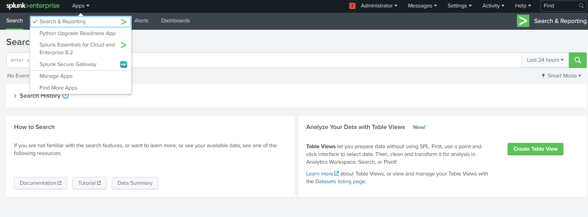
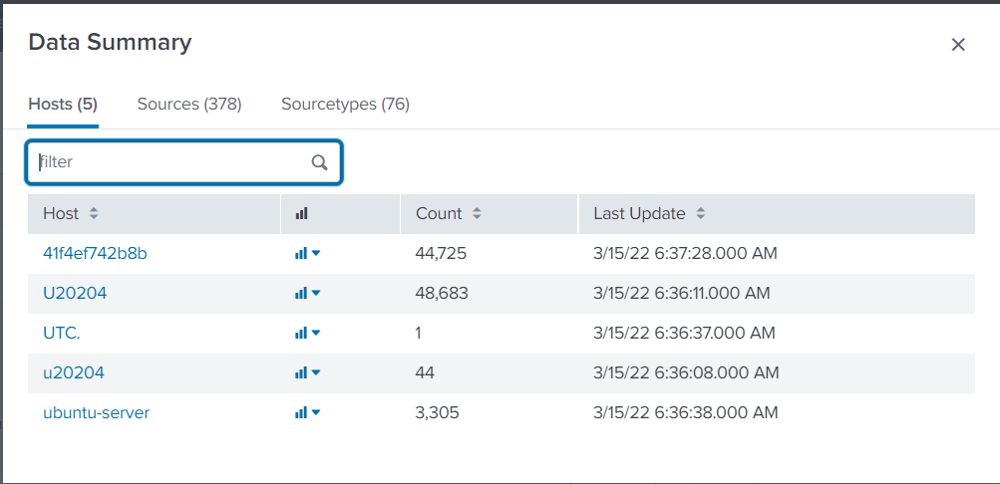
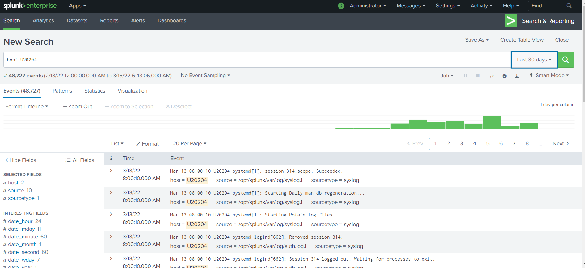

# Docker-Compose Splunk
Docker-compose file for splunk server.

## Deployment:
````
git clone https://github.com/sonnyyu/log-file-analysis/
cd log-file-analysis/splunk
nano  docker-compose.yml 
````
NOTE: change password before turning up container.
## Start splunk
```bash
docker-compose up -d 
```
## Usage:
- Use Docker host IP address via http://[host IP]:8000
- Login via credentials user: admin, password with one you put on the docker-compose yml.





## Stop splunk
```bash
docker-compose up -d 
```
# Use mtls-cert-manage generate server/client/ca certificate 

[https://github.com/sonnyyu/mtls-cert-manage](https://github.com/sonnyyu/mtls-cert-manage)

# Copy Certificate from mtls-cert-manage
```bash
cd ~/mtls-cert-manage/cert 
cp * ~/log-file-analysis/splunk/certs
```
# Make PEM for splunk
```bash
cd ~/log-file-analysis/splunk/certs
openssl x509 -inform PEM -in localhost.crt > localhost.pem
```
# restart splunk
```bash
docker-compose restart
```
# Open splunk from Browser
```bash
https://192.168.1.204:8000
```


